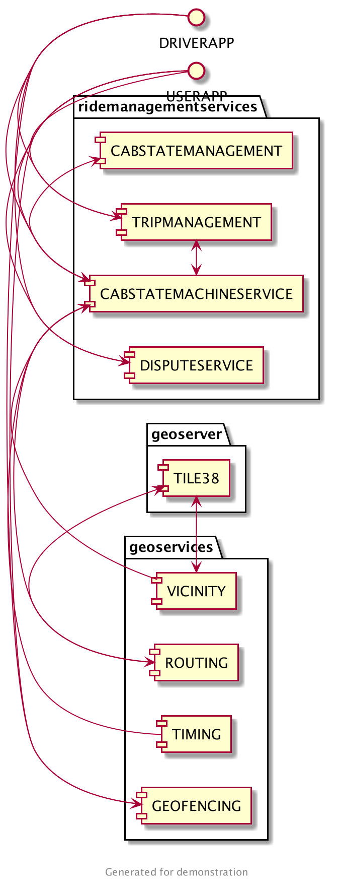
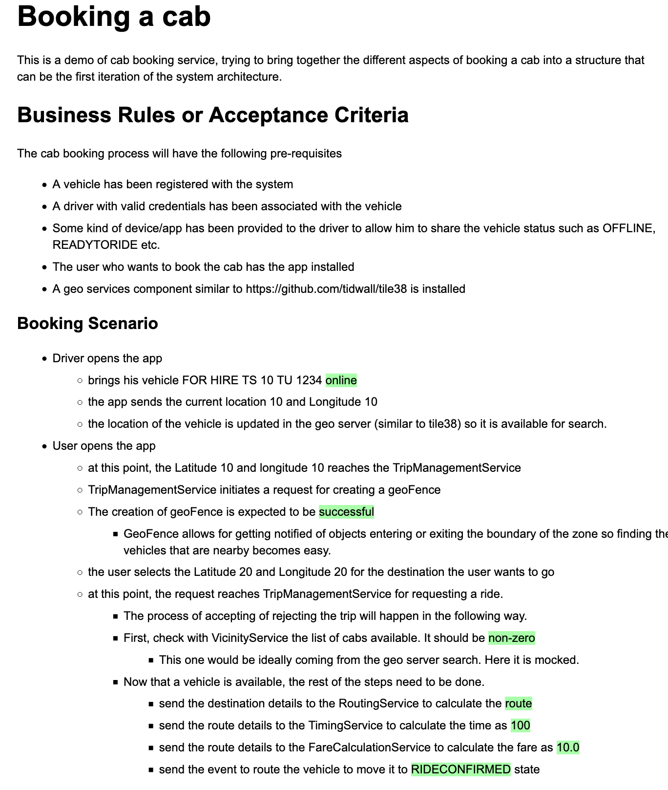

# cab-booking

A demo project to design cab booking

## Problem Statement
Existing cab booking services (hypothetical, for demo purposes) are not on-demand. People have to decide many hours before on where they want to go.
The proposed solution would make cab booking on-demand as well as location based. This will let people take a ride within a reasonable time frame from when they decide to travel

## Functional Requirements.

- User should be able to register for the service.
- User should be able to book a ride from his current location to a destination of choice.
- User should be able to pay for the ride digitally or by cash.
......

## Non Functional Requirements
- The booking service should be available on smart phone as well as on web.
- The maximum amount of time needed by the application to book or fail should be 1 minute.
- The maximum waiting time for cab should be 15 minutes.
......

## Actors
The type of users of the system:
- User : The one who wants to book the ride.
- Driver : The one who provides the ride.
- Support : The support person who can help resolve issues.
......

## Components.
  

Some simple scenarios are defined in the Concordion specifications.

